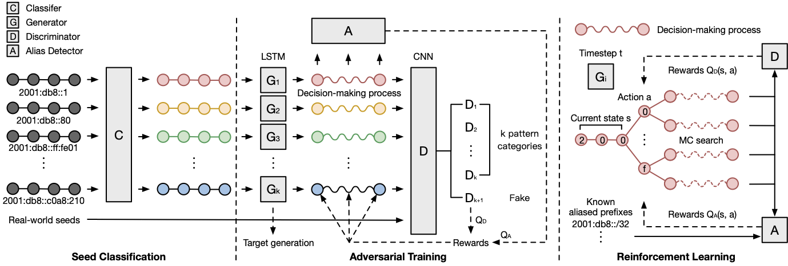

# 6GAN

**The repository of 6GAN, an IPv6 multi-pattern target generation algorithm using Generative Adversarial Nets with reinforcement learning.**

6GAN forces **multiple generators** to train with **a multi-class discriminator** and **an alias detector** to generate non-aliased active targets with different addressing pattern types. The rewards from the discriminator and the alias detector help supervise the **address sequence decision-making process**. 



The work is introduced in the 2021 IEEE International Conference on Computer Communications (INFOCOM 2021):

> Tianyu Cui, Gaopeng Gou, Gang Xiong, Chang Liu, Peipei Fu, Zhen Li. 6GAN: IPv6 Multi-Pattern Target Generation via Generative Adversarial Nets with Reinforcement Learning. INFOCOM 2021: 1-10

Note: this code is based on [SeqGAN](https://github.com/LantaoYu/SeqGAN) and [SentiGAN](https://github.com/Nrgeup/SentiGAN). Many thanks to the authors.

## Requirements

* Python 3
* [TensorFlow](https://www.tensorflow.org/install/) (1.0 or later)
* [gensim](https://radimrehurek.com/gensim/models/word2vec.html)
* [scikit-learn](http://scikit-learn.org/stable/)
* [ipaddress](https://docs.python.org/3/library/ipaddress.html#module-ipaddress)
* [ipv6toolkit](https://github.com/fgont/ipv6toolkit) (Seed classification with **RFC Based** method)
* [entropy-clustering](https://github.com/pforemski/entropy-clustering) (Seed classification with **Entropy Clustering** method)

## Data

[IPv6 Hitlist](https://ipv6hitlist.github.io/) provides an IPv6 Hitlist Service to publish **responsive IPv6 addresses, aliased prefixes, and non-aliased prefixes** to interested researchers, which could be used as the seed addresses of target generation algorithms like 6GAN.

To use the seed dataset and the aliased prefixes data, please specify the `source_file` path and the `aliased_prefix_file` path in `train.py`.

## Run

```shell
python train.py
```

## Seed Classification

### Overview

6GAN could freely choose one of the following three classification methods to determine the addressing patterns to be learned by generators:

* `RFC Based` : Possible IPv6 addressing patterns proposed in [RFC 7707](https://www.rfc-editor.org/rfc/rfc7707.html).
* `Entropy Clustering` : Unsupervised clustering to discover the prefix-level pattern set.
* `IPv62Vec` : Pattern clusters in the vector space using context learning of address words. 

### Requirements

To use **RFC Based** and **Entropy Clustering** methods, you should first install the [ipv6toolkit](https://github.com/fgont/ipv6toolkit) and [entropy-clustering](https://github.com/pforemski/entropy-clustering) requirements respectively. Then modify the `cmd` codes in the two classifier class in `classifier.py`.

For the **RFC Based** method, `YOUR_IPV6TOOLKIT_HOMEDIR` should be the your ipv6toolkit home directory:

```txt
'cat data/source_data/responsive-addresses.work | YOUR_IPV6TOOLKIT_HOMEDIR/addr6 -i -d > data/save_data/rfc_profile.txt'
```

For the **Entropy Clustering** method,  `YOUR_ENTROPY_CLUSTERING_HOMEDIR` should be your entropy-clustering home directory:

```text
'cat data/source_data/responsive-addresses.data | ' + \
'YOUR_ENTROPY_CLUSTERING_HOMEDIR/profiles > data/save_data/ec_profile.txt'
```

```
'cat data/save_data/ec_profile.txt | ' + \
'YOUR_ENTROPY_CLUSTERING_HOMEDIR/clusters -kmeans -k ' \
+ str(k) + ' > data/save_data/ec_cluster.txt'
```

## Multi-Pattern Targets

When training the model, the generated targets under different epochs could be find in `data\candidate_set`. Each generator learns the classified seed data in `category_data` respectively and generates the pattern-specific addresses. The candidate lists could be input to the network scanner like [Zmapv6](https://github.com/tumi8/zmap) to obtain the active IPv6 targets.

## Cite

We hope the work could help more researchers chasing IPv6 addressing patterns and target generation. If the code is helpful in your work, please cite our paper:

```
@inproceedings{cui20216gan,
  title={6GAN: IPv6 Multi-Pattern Target Generation via Generative Adversarial Nets with Reinforcement Learning},
  author={Cui, Tianyu and Gou, Gaopeng and Xiong, Gang and Liu, Chang and Fu, Peipei and Li, Zhen},
  booktitle={IEEE INFOCOM 2021-IEEE Conference on Computer Communications},
  pages={1--10},
  year={2021},
  organization={IEEE}
}
```